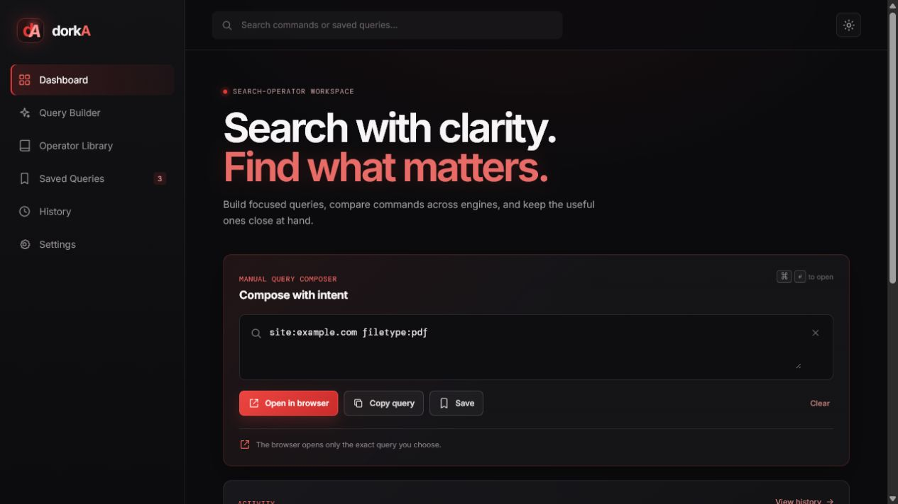
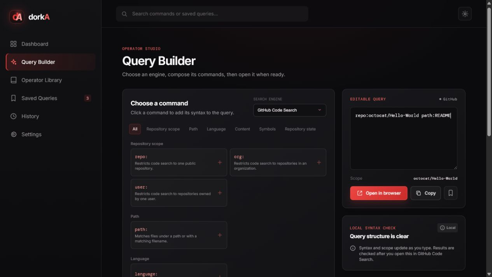

# dorkA

<p align="center">
  
  
</p>

dorkA is a local Windows desktop workspace for composing, saving, and manually
opening search-operator queries. It keeps search activity and saved queries on
your computer, with no account or hosted backend required.

## Highlights

- Multi-engine Query Builder for Google, Bing, Yandex, GitHub Code Search, and
  Wayback Machine CDX.
- Social platform path shortcuts for Instagram posts and reels, Facebook posts
  and reels, plus X/Twitter status pages.
- Engine-specific command chips, syntax guidance, scope checks, and live query
  preview.
- Manual browser opening only - searches open only after you choose the action.
- Local saved queries, favorites, notes, tags, history, and theme preferences.
- Dark desktop UI with light-mode support, keyboard navigation, focus states,
  and copy feedback.
- Windows setup script that installs dependencies, packages the app, and creates
  a desktop shortcut.

## Quick start

### Windows setup

Run [setup.bat](setup.bat). It installs Node.js LTS with `winget` if needed,
installs the project dependencies, builds the portable app, and creates a
`dorkA` desktop shortcut.

### Run from source

```bat
npm install
npm run desktop
```

### Build a portable Windows app

```bat
npm run package:win
```

The generated executable is written to `release\\dorkA 1.0.0.exe`.

## Development

For browser-based frontend work, run the local service and Vite in separate
terminals:

```bat
npm run dev:server
npm run dev
```

Vite runs on `http://127.0.0.1:5174` and proxies local API requests to the
service on port `5173`.

## Local data

The desktop app stores workspace data locally. Saved queries, history, and
preferences are not sent to a hosted service. The `data/` folder used during
standalone local development is intentionally excluded from Git.

## Project structure

```text
src/                   React interface and styles
electron/              Native desktop window and safe browser handoff
server/                Local workspace data service
assets/screenshots/    README screenshots
setup.bat              Windows setup and desktop-shortcut script
```

## License

dorkA is free for personal, non-commercial use. Redistribution, publishing,
forking, modification, and commercial use require the original author's
permission. See [LICENSE](LICENSE) for the complete terms and third-party
notices.
